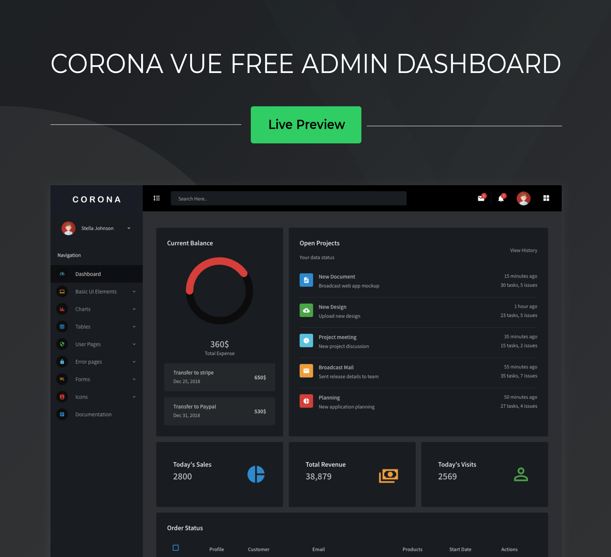

## Corona Vue - Free Admin Template
Love dark mode? Here’s Corona Vue, now available as a free template. Don’t let the name scare you, Corona is a sleek, stylish, and sexy new admin dashboard from BootstrapDash that is super easy to customize and set up. It is one of our most popular admin dashboard templates. This free version has enough features for you to kickstart your project. If you like what you see, then check out the full version of this [Vue admin template](https://www.bootstrapdash.com/product/corona-vue/) too.

### Demo
Click the image below to get a live preview.
[](https://www.bootstrapdash.com/demo/corona-vue-free/preview/demo_1/)

### Documentation

Click [here](https://www.bootstrapdash.com/demo/corona-vue-free/documentation/documentation.html) to check out the documentation

### Need support?
Report your issues with as many details as you can provide and we’ll try to get back to you as soon as possible.

### More from BootstrapDash
Here are some of our most popular templates:

- [StarAdmin Free Bootstrap Admin Template](https://github.com/BootstrapDash/StarAdmin-Free-Bootstrap-Admin-Template)

- [PurpleAdmin Free Admin Template](https://github.com/BootstrapDash/PurpleAdmin-Free-Admin-Template)

- [MajesticAdmin Free Bootstrap Admin Template](https://github.com/BootstrapDash/MajesticAdmin-Free-Bootstrap-Admin-Template)
  
### Like what you see?
Please leave a star on our GitHub repo.
Submit bugs and help us improve Stellar Admin Vue!
Find us on 

- [Twitter](https://twitter.com/bootstrapdash?lang=en)
  
- [Facebook](https://www.facebook.com/bootstrapdash/)
  
- [Instagram](https://www.instagram.com/bootstrapdash/?hl=en)
  
- [Behance](https://www.behance.net/bootstrapdash)
  
- [Pinterest](https://www.pinterest.com/bootstrapdash/)
  
- [Dribbble](https://dribbble.com/bootstrapdash)
  
- [LinkedIn](https://in.linkedin.com/in/bootstrapdash)

Meticulously built at BootstrapDash. We hope you ❤ Corona Vue!

### Additional Information:

#### Installation

##### What's included

Within the download you'll find the following directories and files, logically grouping common assets and providing both compiled and minified variations. You'll see something like this:

```
corona-vue-free-admin-template/
  ├── template
    ├── demo_1
        ├── src/
            ├── app/
            ├── assets/
                ├── images/
                ├── styles/
            ├── index.js
        ├── public/
        ├── .gitignore
        ├── CHANGELOG.md
        ├── package.json
  ├── CHANGELOG.md
  ├── documentation
  ├── LICENSE
  ├── README.md

```
#### Usage
##### clone the repo
$ git clone https://github.com/BootstrapDash/corona-vue-free-admin-template.git

##### go into app's directory
$ cd corona-vue-free-admin-template

##### install dependencies
npm install

##### serve with hot reload at localhost:8080
npm run dev

##### build for production with minification
npm run build

#### Advanced Options

##### build for production and view the bundle analyzer report
npm run build --report

##### run unit tests
npm run unit

##### run e2e tests
npm run e2e

##### run all tests
npm test
For a detailed explanation on how things work, check out the [guide](http://vuejs-templates.github.io/webpack/) and [docs for vue-loader](https://vue-loader-v14.vuejs.org/).

